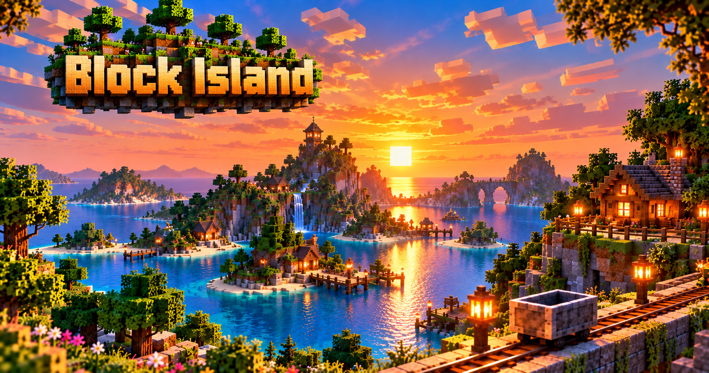

# Block Island

**Block Island** is an experimental voxel engine and sandbox demo built with **Unity 6000.6.3f1**.

The project is **AI-assisted** and focuses on large voxel worlds, creative building and world exploration.

## Features

- Large chunk-based voxel worlds
- Block building and destruction
- 8 × 8 × 8 Micro-Voxel System** – up to 512 mini-blocks inside one block
- TNT blocks with terrain destruction
- Copy & Paste for voxel structures
- Integrated Texture Editor
- Custom blocks and textures
- Import and loading of voxel worlds
- Multiple worlds / world selection
- Dynamic day & night
- Weather and water
- Vegetation and environmental objects
- Graphics Quality Settings
- Configurable controls
- 32:9 Ultrawide support

## Technology

- **Engine:** Unity 6000.6.3f1
- **Language:** C#
- **Development:** Human-directed, AI-assisted

## Status

**Experimental demo project – work in progress.**

Block Island is a technology and sandbox demo for experimenting with voxel worlds, building systems and game development.
